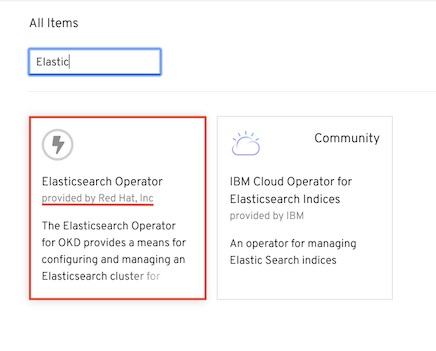
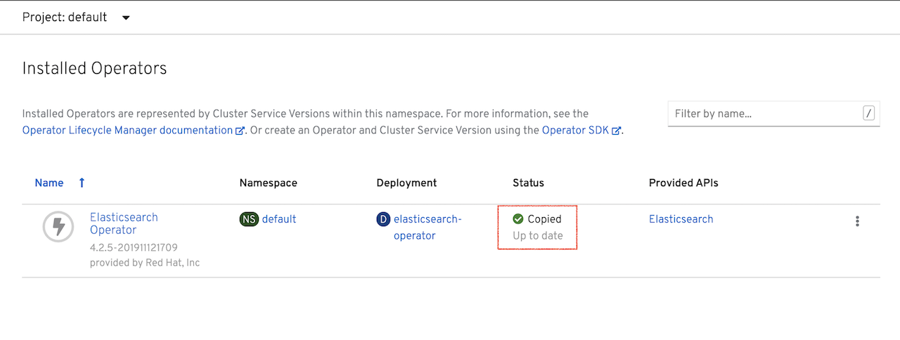

# Red Hat OpenShift Service Mesh Installation Lab

Use the Red Hat OpenShift Service Mesh operator to deploy a multi-tenant Service Mesh

## Setup

Installing the OpenShift Service Mesh involves :

* Install Elasticsearch Operator
* Intall Jaeger Operator
* Install Kiali Operator
* Installing the Service Mesh Operator
* Create project istio-system
* Creating and managing a ServiceMeshControlPlane resource to deploy the Service Mesh control plane
* Creating a ServiceMeshMemberRoll resource to specify the namespaces associated with the Service Mesh.

## Install Operators

**Remark: Instructor already installed all operators for you. This is per cluster activities.**

Login to OpenShift Web Console using Adimin user
* In the OCP Web Console, navigate to: Catalog -> Operator Hub
* In the OperatorHub catalog of your OCP Web Console, type Elasticsearch into the filter box to locate the Elasticsearch Operator (by Red Hat)
     
* Click the Elasticsearch Operator to display information about the Operator and Click Install
     
* On the Create Operator Subscription page. Select All namespaces on the cluster (default). This installs the Operator in the default openshift-operators project and makes the Operator available to all projects in the cluster and Click Subscribe
      
* The Subscription Overview page displays the Elasticsearch Operator’s installation progress. Following screen show Elasticsearch oprator installed.
     
* Repeat all steps for Jaeger, Kiali and OpenShift Service Mesh. **Select Operator that provided by Red Hat not Community version.**
* Following screen show all 4 operators are installed.
     

