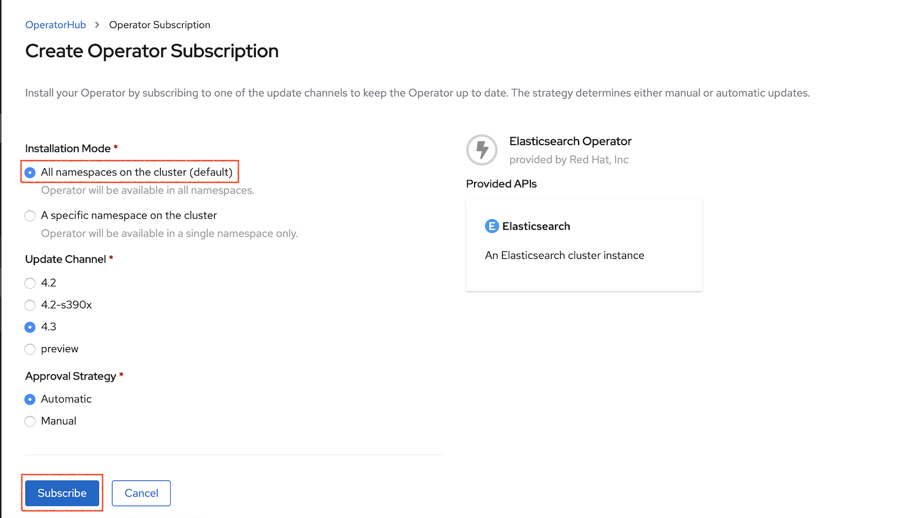
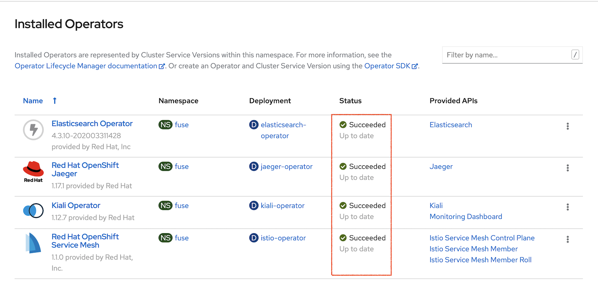

# Red Hat OpenShift Service Mesh Installation Lab

Use the Red Hat OpenShift Service Mesh operator to deploy a multi-tenant Service Mesh

## Setup

Installing the OpenShift Service Mesh involves :

* Install Elasticsearch Operator
* Intall Jaeger Operator
* Install Kiali Operator
* Installing the Service Mesh Operator
* Create project istio-system
* Creating and managing a ServiceMeshControlPlane resource to deploy the Service Mesh control plane
* Creating a ServiceMeshMemberRoll resource to specify the namespaces associated with the Service Mesh.

## Install Operators
Login to OpenShift Web Console using Adimin user
* In the OCP Web Console, navigate to: Catalog -> Operator Hub
* In the OperatorHub catalog of your OCP Web Console, type Elasticsearch into the filter box to locate the Elasticsearch Operator (by Red Hat)
     
* Click the Elasticsearch Operator to display information about the Operator and Click Install
     
* On the Create Operator Subscription page. Select All namespaces on the cluster (default). This installs the Operator in the default openshift-operators project and makes the Operator available to all projects in the cluster and Click Subscribe
      
* The Subscription Overview page displays the Elasticsearch Operator’s installation progress. Following screen show Elasticsearch oprator installed.
     
* Repeat all steps for Jaeger, Kiali and OpenShift Service Mesh
* Following screen show all 4 operators are installed.
     
## Service Mesh Control Plane
Now that the Service Mesh Operator has been installed, you can now install a Service Mesh control plane.
The previously installed Service Mesh operator watches for a ServiceMeshControlPlane resource in all namespaces. Based on the configurations defined in that ServiceMeshControlPlane, the operator creates the Service Mesh control plane.

In this section of the lab, you define a ServiceMeshControlPlane and apply it to the istio-system namespace.

* Create a namespace called istio-system where the Service Mesh control plane will be installed.
* Install Control Plane using the custom resource file [basic install](../install/basic-install.yml)
    Mutual TLS is disbled by setting mtls to false.
    Kiali user is single sign-on with OpenShift
* Create the service mesh control plane in the istio-system project
  
  ```
  oc apply -f install/istio-installation.yml -n istio-system
  ```
* Watch the process of deployment
  
  ```
  watch oc get pods -n istio-system
  ```
  
  The entire installation process can take approximately 10-15 minutes. Confirm that following pods are up and running
  
  

## Service Mesh Member Roll
The Service Mesh operator has installed a control plane configured for multitenancy. This installation reduces the scope of the control plane to only those projects/namespaces listed in a ServiceMeshMemberRoll.

In this section of the lab, you create a ServiceMeshMemberRoll resource with the project/namespaces you wish to be part of the mesh. This ServiceMeshMemberRoll is required to be named default and exist in the same namespace where the ServiceMeshControlPlane resource resides (ie: istio-system).

Sample Service Mesh Member Roll [Member Roll](../install/memberroll.yml) for project name "user1" and "user2"
```
apiVersion: maistra.io/v1
kind: ServiceMeshMemberRoll
metadata:
  name: default
spec:
  members:
  - user1
  - user2

```

Create member roll

```
oc apply -f install/memberroll.yml -n istio-system
```
