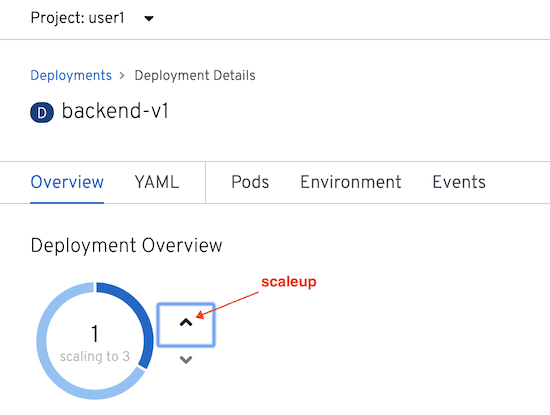
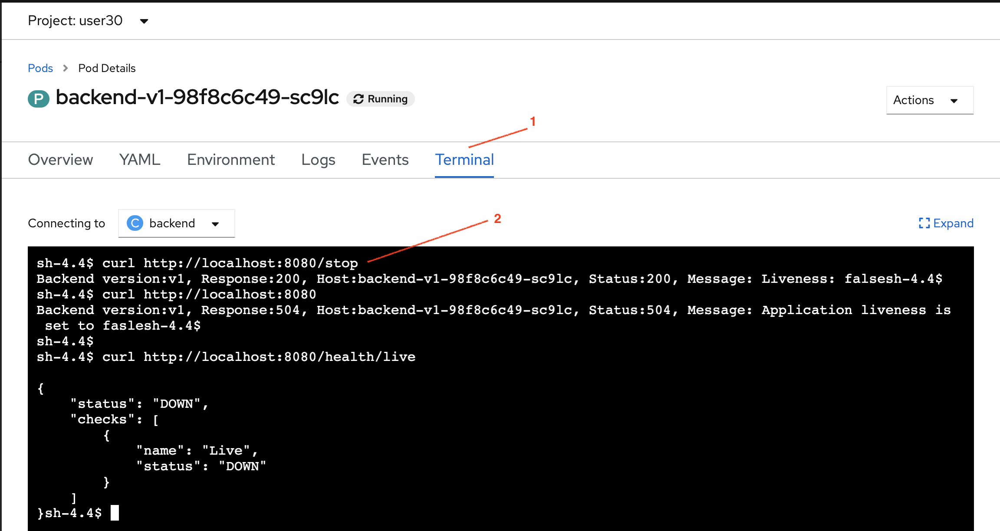

# Service Resilience by Circuit Breaker Lab


## Setup
Setup microservices apps by remove backend-v2 and scale backend-v1 to 3 pods. 


```

oc delete -f ocp/backend-v2-deployment.yml -n $USERID
oc scale deployment backend-v1 --replicas=3 -n $USERID
watch oc get pods -n $USERID

# or 
# oc get pods -w -n $USERID
# Wait until all backend-v1 pods status are Runnings and all container in pods are ready (2/2)

```

Sample output

```

NAME                          READY   STATUS    RESTARTS   AGE
backend-v1-6ddf9c7dcf-sqxqz   2/2     Running   0          8h
backend-v1-6ddf9c7dcf-vm6kb   2/2     Running   0          8h
backend-v1-6ddf9c7dcf-x6gkh   2/2     Running   0          8h
frontend-v1-655f4478c-wn7wr   2/2     Running   0          9h

```

You can also scaleup pod by using OpenShift Web Console. Select Workloads->Deployment on the left-menu. Then select backend-v1


Scale pod to 3 by click upper arrow icon.



We will force one backend-v1 pod to return 504. This can be done by rsh into pod the curl to /stop (backend-v1 will always return 504 after receiving /stop. This is for demo)

Select one pod and connect to pod's terminal by using following oc command or OpenShift Web Console.

```

oc exec -n $USERID  <pod name> curl http://localhost:8080/stop

```

You can also use OpenShift Web Console. Select Workloads->Pods on the left-menu. Then select one of backend-v1 pods.


select Terminal tab then run cURL command



Test with [run50.sh](../scripts/run-50.sh) and check that with averagely 3 requests 1 request will response with response code 504

```

scripts/run-50.sh

```

Sample output
```
...
Backend:v1, Response Code: 200, Host:backend-v1-54696877b-z55b6, Elapsed Time:1.225209 sec
Backend:v1, Response Code: 200, Host:backend-v1-54696877b-gl6kd, Elapsed Time:5.816343 sec
Backend:v1, Response Code: 504, Host:backend-v1-54696877b-zvlp8, Elapsed Time:0.192307 sec
Backend:v1, Response Code: 200, Host:backend-v1-54696877b-z55b6, Elapsed Time:3.807361 sec
Backend:v1, Response Code: 200, Host:backend-v1-54696877b-gl6kd, Elapsed Time:0.850139 sec
Backend:v1, Response Code: 504, Host:backend-v1-54696877b-zvlp8, Elapsed Time:0.111848 sec
Backend:v1, Response Code: 200, Host:backend-v1-54696877b-z55b6, Elapsed Time:0.334275 sec
Backend:v1, Response Code: 200, Host:backend-v1-54696877b-gl6kd, Elapsed Time:0.346220 sec
Backend:v1, Response Code: 504, Host:backend-v1-54696877b-zvlp8, Elapsed Time:0.114360 sec
...
```

## Circuit Breaker and Pool Ejection

Review the following Istio's destination rule configuration file [destination-rule-backend-circuit-breaker-with-pool-ejection.yml](../istio-files/destination-rule-backend-circuit-breaker-with-pool-ejection.yml)  to define circuit breaker and pool ejection with following configuration.

```

...
trafficPolicy:
      connectionPool:
        http: {}
        tcp: {}
      loadBalancer:
        simple: ROUND_ROBIN
      outlierDetection:
        baseEjectionTime: 15m
        consecutiveErrors: 1
        interval: 15m
        maxEjectionPercent: 100
# Detect error with condition:
# If found 1 consecutive error (consecutiveErrors)
# then eject that pod from pool for 15 minutes (baseEjectionTime)
# All of pods can be ejected (maxEjectionPercent)
# check again within 15 minutes (interval)
...

```

Apply destination rule to enable circuit breaker with pool ejection for backend service

```

oc apply -f istio-files/virtual-service-backend.yml -n $USERID
oc apply -f istio-files/destination-rule-backend-circuit-breaker-with-pool-ejection.yml -n $USERID

```

Sample output

```
virtualservice.networking.istio.io/backend-virtual-service created
destinationrule.networking.istio.io/backend-destination-rule created
```

## Test

Test with [run50.sh](../scripts/run-50.sh) again and check that you will get 504 only one time. Because that particular pod is ejected from pool and only pods those return 200 OK still stayed in pool.

Sample output

```

Backend:v1, Response Code: 504, Host:backend-v1-54696877b-zvlp8, Elapsed Time:0.131285 sec
Backend:v1, Response Code: 200, Host:backend-v1-54696877b-gl6kd, Elapsed Time:1.036776 sec
Backend:v1, Response Code: 200, Host:backend-v1-54696877b-z55b6, Elapsed Time:1.079769 sec
Backend:v1, Response Code: 200, Host:backend-v1-54696877b-gl6kd, Elapsed Time:0.360221 sec
Backend:v1, Response Code: 200, Host:backend-v1-54696877b-z55b6, Elapsed Time:0.340531 sec
Backend:v1, Response Code: 200, Host:backend-v1-54696877b-gl6kd, Elapsed Time:0.353228 sec
Backend:v1, Response Code: 200, Host:backend-v1-54696877b-gl6kd, Elapsed Time:0.407192 sec
Backend:v1, Response Code: 200, Host:backend-v1-54696877b-z55b6, Elapsed Time:0.407578 sec
Backend:v1, Response Code: 200, Host:backend-v1-54696877b-gl6kd, Elapsed Time:0.394858 sec
Backend:v1, Response Code: 200, Host:backend-v1-54696877b-z55b6, Elapsed Time:0.396541 sec
Backend:v1, Response Code: 200, Host:backend-v1-54696877b-gl6kd, Elapsed Time:0.376350 sec
Backend:v1, Response Code: 200, Host:backend-v1-54696877b-z55b6, Elapsed Time:0.369998 sec
Backend:v1, Response Code: 200, Host:backend-v1-54696877b-gl6kd, Elapsed Time:0.339832 sec
Backend:v1, Response Code: 200, Host:backend-v1-54696877b-gl6kd, Elapsed Time:0.332309 sec
Backend:v1, Response Code: 200, Host:backend-v1-54696877b-z55b6, Elapsed Time:0.339841 sec
Backend:v1, Response Code: 200, Host:backend-v1-54696877b-gl6kd, Elapsed Time:0.325807 sec
Backend:v1, Response Code: 200, Host:backend-v1-54696877b-z55b6, Elapsed Time:0.340239 sec
Backend:v1, Response Code: 200, Host:backend-v1-54696877b-gl6kd, Elapsed Time:0.308159 sec
Backend:v1, Response Code: 200, Host:backend-v1-54696877b-gl6kd, Elapsed Time:0.337028 sec
...
...
========================================================
Total Request: 50
Version v1: 49
Version v2: 0
========================================================

```

## Clean Up

Run oc delete command to remove Istio policy.

```

oc delete -f istio-files/destination-rule-backend-circuit-breaker-with-pool-ejection.yml -n $USERID
oc delete -f istio-files/virtual-service-backend.yml -n $USERID
oc delete -f ocp/backend-v1-deployment.yml -n $USERID
oc delete -f ocp/backend-service.yml -n $USERID
oc delete -f ocp/frontend-v1-deployment.yml -n $USERID
oc delete -f ocp/frontend-service.yml -n $USERID
oc delete -f ocp/frontend-route.yml -n $USERID

```

## Next Topic

[Secure with mTLS](./08-secure-with-mTLS.md)
